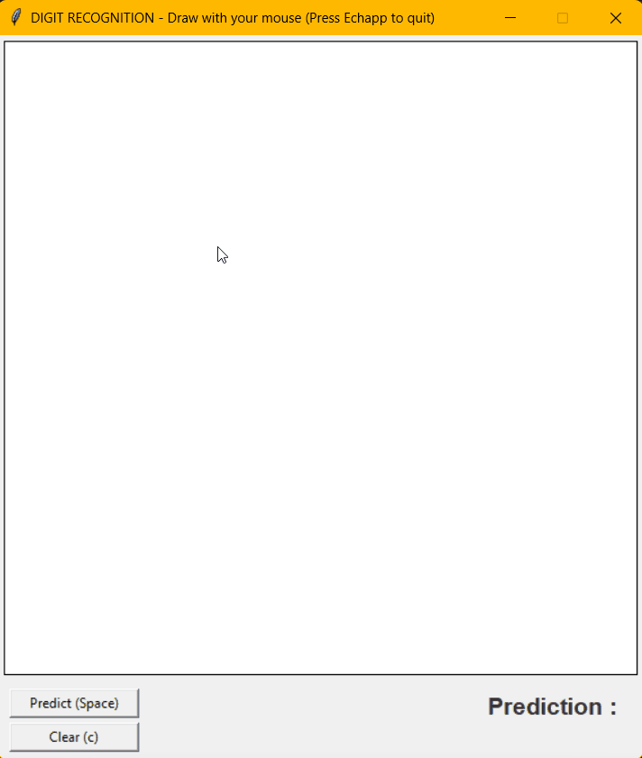

# Reconnaissance de chiffres interactive



Petite IA de détection de chiffres (Réseau de Neurones Convolutifs) avec interface pour reconnaître vos chiffres. 

```bash
# Cloner le dépôt
git clone https://github.com/Mathieu-Jousson/digit_recognition.git
cd digit_recognition

# Installer les dépendances (pas grand chose)
pip install -r requirements.txt

# Lancer l'appli 
python main.py
```


# Interactive Digit Recognition


A small digit detection AI (Convolutional Neural Network) featuring an interface to recognize your handwritten digits.

```bash
# Clone the repository
git clone https://github.com/Mathieu-Jousson/digit_recognition.git
cd digit_recognition

# Install dependencies (not so much)
pip install -r requirements.txt

# Run the app
python main.py
```